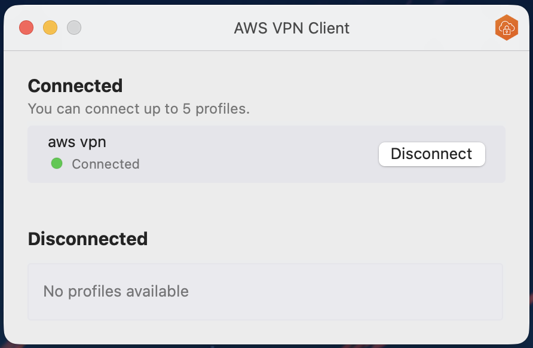
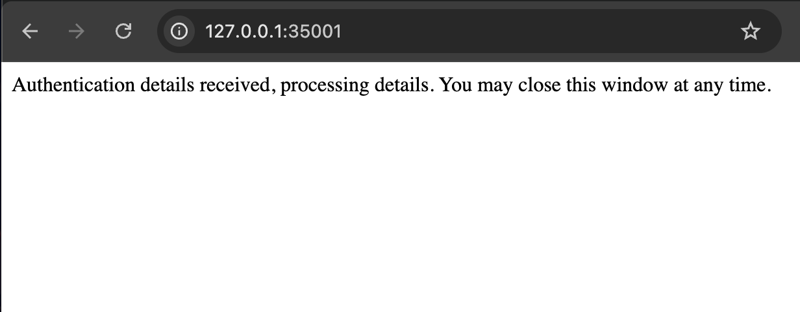

# AWS VPN Tab Closer

A Chrome extension that automatically closes the authentication tab left open by the AWS VPN client.

## Why?

Every time the AWS VPN client re-authenticates, it pops open a browser tab on `http://127.0.0.1:35001` that just sits there. Step away from your desk for a bit and you'll return to a graveyard of identical tabs.

## How It Works

This extension watches for that specific localhost tab and automatically closes it once the success message appears. Your initial sign-in flow is left untouched. It only acts after credentials have already been accepted.

## Install

### From Source

1. Clone this repo
2. Open `chrome://extensions/`
3. Enable **Developer mode** (top right)
4. Click **Load unpacked** and select the cloned directory

## Permissions

The extension only activates on `http://127.0.0.1:35001` and does nothing else.
